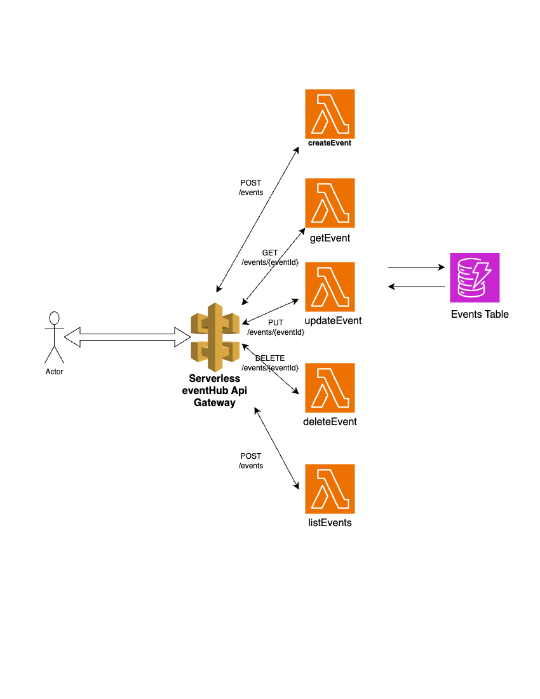

# serverless-eventhub

A Serverless Framework powered Event Ticketing API with CI/CD, DynamoDB, AWS Lambda, and Api Gateway

## Tech Stack highlight

- AWS Lambda
- API Gateway (REST API)
- DynamoDB with TTL
- Serverless Framework
- GitHub Actions CI/CD
- Node.js (AWS SDK v3)
- Esbuild

## Service Architecture Overview



## Features / Technical Design Document (TDD)

- Fully Serverless REST API with CRUD operations.
- Multi-stage deployment support (`dev`, `prod`).
- Fine-grained IAM permissions.
- DynamoDB TTL cleanup using `expiresAt`.
- Secure CI/CD with GitHub Actions.
- API Key protected endpoints.
- Safe field validation and cherry-picked updates.
- Auto-generated `updatedAt` on updates.

## API Contracts

### 1. Create Event

- **POST** `/events`

- **Request:**

```json
{
  "name": "Sports Festival",
  "date": "2025-10-05",
  "location": "Toronto",
  "ticketPrice": 49,
  "availableTickets": 15000
}
```

- **Response (201 Created):**

```json
{
  "success": true,
  "event": {
    "eventId": "6514fe0e-6897-4a85-8800-4d24540edcde",
    "name": "Sports Festival",
    "date": "2025-10-05",
    "location": "New York",
    "ticketPrice": 49,
    "availableTickets": 15000,
    "expiresAt": 1747965010,
    "createdAt": "2025-05-16T01:50:10.113Z",
    "updatedAt": "2025-05-16T01:50:10.113Z"
  }
}
```

### 2. Get Event by ID

- **GET** `/events/{eventId}`

- **Response (200 OK):**

```json
{
  "event": {
    "eventId": "6514fe0e-6897-4a85-8800-4d24540edcde",
    "name": "Sports Festival",
    "date": "2025-10-05",
    "location": "New York",
    "ticketPrice": 49,
    "availableTickets": 15000,
    "expiresAt": 1747965010,
    "createdAt": "2025-05-16T01:50:10.113Z",
    "updatedAt": "2025-05-16T01:50:10.113Z"
  }
}
```

- **Response (404):**

```json
{
  "error": "Event not found"
}
```

### 3. Update Event by ID

- **PUT** `/events/{eventId}`

- **Request:**

```json
{
  "date": "2025-05-31",
  "availableTickets": 300
}
```

- **Response (200 OK):**

```json
{
  "event": {
    "eventId": "9ad271db-ac70-4297-9239-1ce4b11bbdfc",
    "date": "2025-05-31",
    "location": "Toronto, Canada",
    "expiresAt": 1747961959,
    "updatedAt": "2025-05-16T01:07:55.606Z",
    "ticketPrice": 50,
    "createdAt": "2025-05-16T00:59:19.905Z",
    "availableTickets": 300,
    "name": "Serverless Dev meetup"
  }
}
```

- **Response (404):**

```json
{
  "error": "Event not found or update failed"
}
```

### 4. Delete Event by ID

- **DELETE** `/events/{eventId}`
- **Response (204 No Content):**

- **Response (404):**

```json
{
  "error": "Event not found"
}
```

### 5. List Events

- **GET** `/events`

- **Response (200 OK):**

```json
{
  "events": [{
    "eventId": "6514fe0e-6897-4a85-8800-4d24540edcde",
    "name": "Sports Festival",
    "date": "2025-10-05",
    "location": "New York",
    "ticketPrice": 49,
    "availableTickets": 15000,
    "expiresAt": 1747965010,
    "createdAt": "2025-05-16T01:50:10.113Z",
    "updatedAt": "2025-05-16T01:50:10.113Z"
  },
  ...]
}
```

## AWS Region : us-east-1

## Deployment Process

## Triggered on pushes to feature/\*, dev, and main

## Contributor: Richmond
